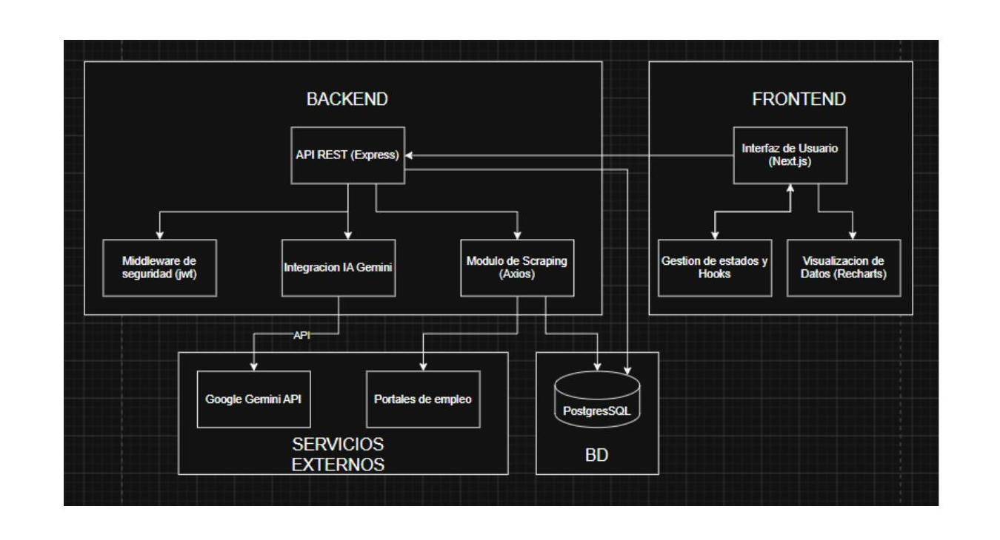
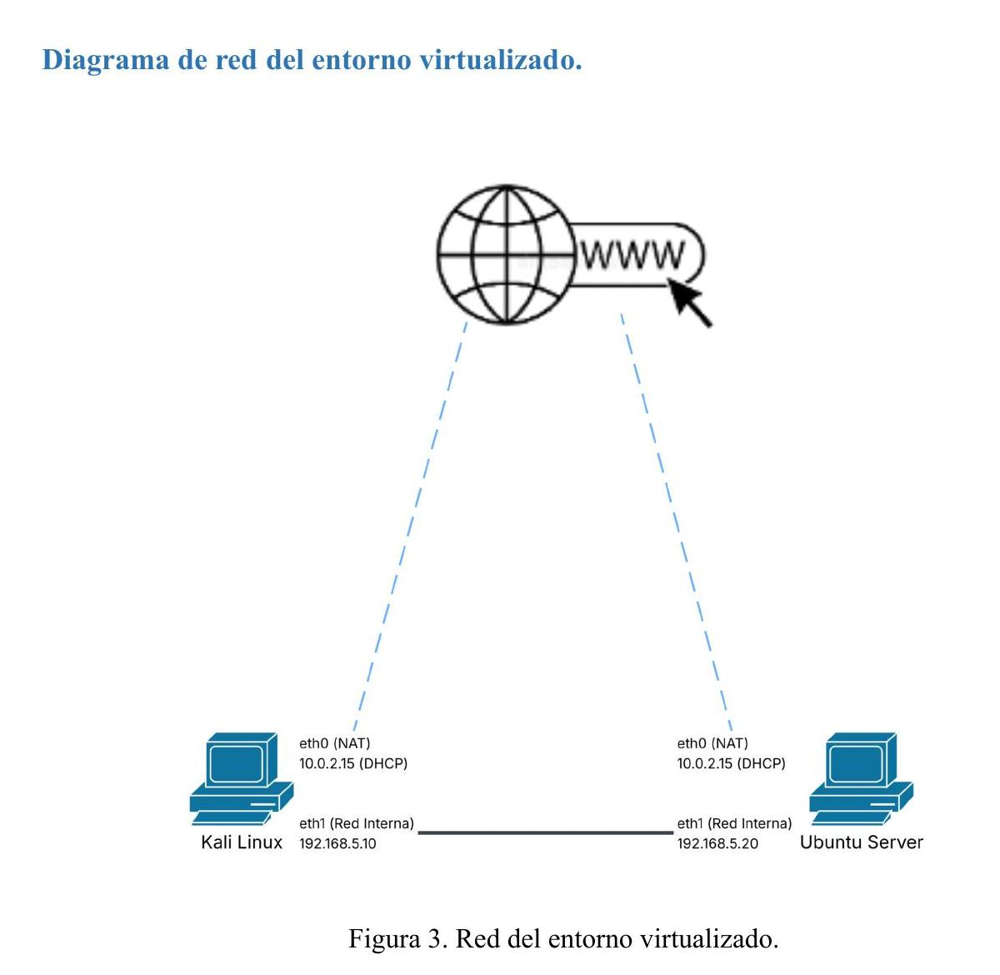

# 🤖 AutoApply Bot — Laboratorio de Ciberseguridad

**Universidad Católica Andrés Bello · Escuela de Informática · Ciberseguridad 2025-2026**
**Prof. Gustavo Lara Jr.**

Simulación completa del ciclo de vida de un ataque informático —desde la construcción
deliberada de vulnerabilidades, pasando por su explotación controlada, hasta la
remediación técnica— sobre **AutoApply Bot**, una aplicación web real que automatiza
postulaciones freelance con IA (Google Gemini). Todo el trabajo se mapea con el
framework **MITRE ATT&CK®**.

> ⚠️ **Repositorio académico con fines exclusivamente educativos.** Todo ataque se
> ejecuta dentro de un entorno virtualizado aislado (VirtualBox, Red Interna), nunca
> contra sistemas reales o externos.

---

## 📌 Para el evaluador — mapa rápido del repositorio

Este proyecto cubre **5 vulnerabilidades** (2 obligatorias + 1 de innovación + 2 adicionales)
y **2 componentes de innovación en defensa** (Prompt Injection hardening y pipeline DevSecOps).

### Ramas

| Rama | Contenido |
|---|---|
| **`main`** | Este README, documentación general y diagramas. Código base del proyecto. |
| **`version-vulnerable`** | Código con las vulnerabilidades + documentación ofensiva + evidencias del ataque. |
| **`version-sanitizada`** | Código con los parches y contramedidas + documentación defensiva + pipeline CI/CD. |

### Dónde está cada entregable

| Requisito del enunciado | Ubicación |
|---|---|
| README técnico (despliegue + stack) | `README.md` (este archivo, en `main`) |
| Inventario de endpoints | [`docs/endpoint-inventory.md`](docs/endpoint-inventory.md) |
| Diagrama de flujo de datos (puntos de ruptura) | [`docs/images/data-flow-diagram.png`](docs/images/data-flow-diagram.png) · fuente: [`docs/diagrams/data-flow-diagram.puml`](docs/diagrams/data-flow-diagram.puml) |
| Script de payloads | `scripts/payloads.sh` (rama `version-vulnerable`) |
| Reporte de explotación | `docs/exploitation-report.md` (rama `version-vulnerable`) |
| Reporte de reconocimiento (Nmap/ZAP) | `docs/reconnaissance-report.md` (rama `version-vulnerable`) |
| Mapeo MITRE ATT&CK® | `docs/mitre-attack-mapping.md` (rama `version-vulnerable`) |
| Análisis de impacto (red/BD/servidor/memoria) | `docs/impact-analysis.md` (rama `version-vulnerable`) |
| Evidencias del ataque (capturas) | `docs/Evidencias/` (rama `version-vulnerable`) |
| Validación de remediación (Blue Team) | `docs/blue-team-validacion-evidencias.md` (rama `version-sanitizada`) |
| Configuración del laboratorio | `docs/lab-setup.md` (rama `version-sanitizada`) |
| Pipeline de seguridad (CI/CD) | `.github/workflows/security-gate.yml` (rama `version-sanitizada`) |

---

## 🛡️ Vulnerabilidades del proyecto

| # | Vulnerabilidad | OWASP | CWE | Archivo | Estado |
|---|---|---|---|---|---|
| 1 | **IDOR / Broken Access Control** | A01:2025 | CWE-639 | `controllers/proposalController.ts` | ✅ Explotada y remediada |
| 2 | **Mishandling de errores** | A10:2025 | CWE-209 | `middleware/errorHandler.ts` | ✅ Explotada y remediada |
| 3 | **Prompt Injection** *(innovación)* | LLM01:2025 | CWE-1427 | `services/aiService.ts` | ✅ Explotada y remediada |
| 4 | **Information Leak en reset de contraseña** *(adicional)* | — | CWE-200 | `controllers/vulnerableController.ts` | ✅ Explotada y remediada |
| 5 | **RCE vía `eval()`** *(adicional)* | — | CWE-94 | `controllers/vulnerableController.ts` | ✅ Explotada y remediada |

Selección obligatoria del enunciado: **ID 1** = IDOR (A01:2025) · **ID 2** = Mishandling (A10:2025).

### Vulnerabilidad 1 — IDOR (A01:2025 / CWE-639)
Los controladores de propuestas no verifican que el recurso pertenezca al usuario del
JWT. Cualquier usuario autenticado puede leer, modificar o eliminar propuestas ajenas
alterando el `:id` en la URL. **Parche:** columna `user_id` en `proposals` + validación
de propiedad contra el token, con respuesta `404` anti-enumeración.

### Vulnerabilidad 2 — Mishandling de errores (A10:2025 / CWE-209)
El middleware devolvía `err.message` y `err.stack` en la respuesta HTTP, exponiendo
rutas del servidor, librerías internas y versión de Node. **Parche:** respuesta genérica
al cliente + logging interno con Winston.

### Vulnerabilidad 3 — Prompt Injection (LLM01:2025 / CWE-1427)
`/api/proposals/generate` concatena la descripción de la oferta directamente en el prompt
enviado a Gemini, sin separar dato de instrucción. **Parche:** defensa en profundidad de
4 capas (sanitización, prompt estructurado, `systemInstruction`, validación de salida con
canary).

### Vulnerabilidades adicionales 4 y 5
- **Token leak (CWE-200):** el token de reset viajaba en la respuesta HTTP. **Parche:**
  token hasheado (SHA-256) con expiración, nunca expuesto.
- **RCE (CWE-94):** un endpoint usaba `eval()` sobre entrada del usuario. **Parche:**
  `JSON.parse()` con validación estricta de esquema.

---

## ⚔️ Metodología — MITRE ATT&CK®

| Fase | Táctica | Técnica | Acción |
|---|---|---|---|
| 1 | TA0043 Reconnaissance | T1592 | Nmap + forzar errores para leer el stack trace |
| 2 | TA0001 Initial Access | T1078 | Registro de cuenta legítima → JWT válido |
| 3 | TA0007 Discovery | T1518 | Enumerar IDs secuenciales de propuestas |
| 4 | TA0009 Collection | T1213 | Leer datos de todos los usuarios (IDOR) |
| 5 | TA0010 Exfiltration | T1567 | Modificar/eliminar recursos ajenos vía API |
| 6 | TA0040 Impact | T1565 | Manipular el contenido generado por IA (Prompt Injection) |

Justificación completa y diagrama en `docs/mitre-attack-mapping.md` (rama `version-vulnerable`).

---

## 🗂️ Arquitectura y estructura



```
ciberseguridad-proyecto-2026/
├── backend/src/
│   ├── config/        # Conexión a PostgreSQL
│   ├── controllers/   # Lógica de negocio (proposalController → IDOR)
│   ├── middleware/    # auth.ts (JWT) + errorHandler.ts (A10:2025)
│   ├── models/        # Acceso a datos
│   ├── routes/        # Definición de endpoints
│   ├── services/      # aiService.ts (Prompt Injection)
│   └── utils/         # Seed y utilidades
├── frontend/          # Next.js 14 + TailwindCSS + Recharts
├── database/schema.sql
├── scripts/payloads.sh
└── docs/              # Documentación técnica y evidencias
```

---

## 🛠️ Stack tecnológico

- **Backend:** Node.js 20 · TypeScript · Express · PostgreSQL · JWT · bcryptjs
- **Frontend:** Next.js 14 · TypeScript · TailwindCSS · Recharts · Axios
- **IA:** Google Gemini (Generative AI)
- **Red Team:** Kali Linux · Nmap · OWASP ZAP · curl
- **Blue Team:** Winston (logging) · GitHub Actions · Gitleaks · OWASP ZAP

---

## 🔬 Laboratorio (VirtualBox)



| VM | SO | RAM | IP estática | Rol |
|---|---|---|---|---|
| Kali Linux 2026.1 | Kali Linux | 4 GB | `192.168.5.10` | Atacante — Red Team |
| Ubuntu-Victima | Ubuntu Server 22.04 LTS | 2 GB | `192.168.5.20` | Víctima — Blue Team |

- **Adaptador 1:** NAT (internet para dependencias)
- **Adaptador 2:** Red Interna `vboxnet-proyecto` (laboratorio aislado)

```bash
ping 192.168.5.20              # conectividad entre VMs
ssh ubuntu@localhost -p 2222   # acceso al servidor víctima
```

Detalle completo del entorno en `docs/lab-setup.md` (rama `version-sanitizada`).

---

## 🚀 Despliegue (VM Víctima — Ubuntu Server 22.04)

### 1. Dependencias del sistema
```bash
sudo apt update && sudo apt upgrade -y
sudo apt install -y git nodejs postgresql postgresql-contrib
node --version   # v20.x.x
psql --version   # 14.x o superior
```

### 2. Clonar y elegir la rama
```bash
git clone https://github.com/nahomyrada/ciberseguridad-proyecto-2026.git
cd ciberseguridad-proyecto-2026
git checkout version-vulnerable      # o version-sanitizada
```

### 3. Base de datos
```bash
sudo -u postgres createdb autoapply
cat database/schema.sql | sudo -u postgres psql -d autoapply
```
> ⚠️ Si ya existía la base de datos de una rama anterior, recréala desde cero
> (`DROP DATABASE autoapply;`) antes de aplicar el schema — el `CREATE TABLE IF NOT
> EXISTS` no añade columnas nuevas (p. ej. `user_id`) a tablas ya creadas.

### 4. Backend
```bash
cd backend
npm install
cat > .env << 'EOF'
DB_URL=postgresql://postgres@localhost/autoapply
JWT_SECRET=ciberseguridad-ucab-2026
PORT=3001
NODE_ENV=development
GEMINI_API_KEY=<tu_api_key_de_google_ai_studio>
EOF
npm run seed
npm run dev          # http://192.168.5.20:3001
```
> La `GEMINI_API_KEY` se obtiene gratis en https://aistudio.google.com/apikey y **no está
> versionada** en el repositorio (se maneja como secreto en `.env`, ignorado por git).

### 5. Frontend
```bash
cd frontend
# Fix SWC en Linux: fallback a Babel
cat > .babelrc << 'EOF'
{"presets": ["next/babel"]}
EOF
npm install
cat > .env.local << 'EOF'
NEXT_PUBLIC_API_URL=http://192.168.5.20:3001
EOF
npm run dev          # http://192.168.5.20:3000
```

### Credenciales de demo (tras el seed)
- **Email:** `demo@autoapply.com`
- **Password:** `Demo1234!`

---

## 🎯 Cómo reproducir el ataque

Los comandos completos y comentados están en `scripts/payloads.sh` (rama
`version-vulnerable`). Ejecución fase por fase con evidencia real documentada en
`docs/exploitation-report.md`. Para validar la remediación, se repiten los mismos
payloads contra `version-sanitizada` (ver `docs/blue-team-validacion-evidencias.md`).

---

## 👥 Equipo

| Integrante | Team | Rol |
|---|---|---|
| Baladi, Anthonny | 🔴 Red | Líder Ofensivo — MITRE ATT&CK® |
| Gómez, Ronald | 🔴 Red | Reconocimiento y auditoría (Nmap, ZAP) |
| Rada, Nahomy | 🔴 Red | Explotación y payloads |
| Castellano, Gabriel | 🔵 Blue | Líder Defensivo, arquitectura y pipeline |
| Cova, César | 🔵 Blue | Infraestructura y red |
| Ojeda, José | 🔵 Blue | Hardening y DevSecOps |

---

## 📜 Consideraciones éticas

Todo el código vulnerable y los payloads tienen fines exclusivamente educativos y se
ejecutan únicamente dentro del entorno de laboratorio aislado descrito arriba. Su uso
fuera de este contexto está prohibido.
