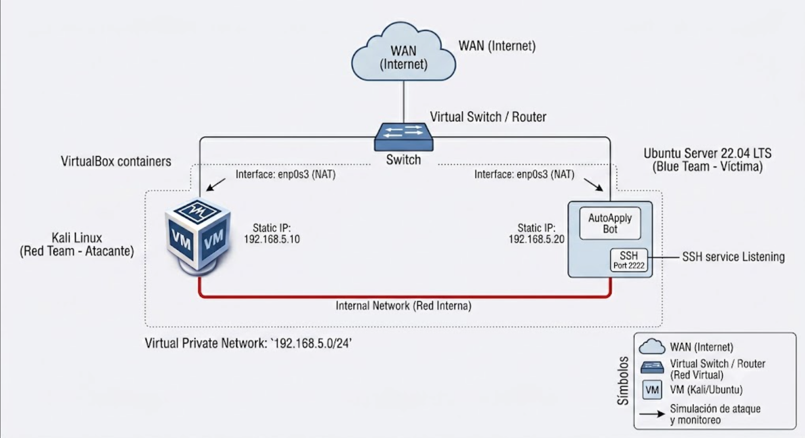
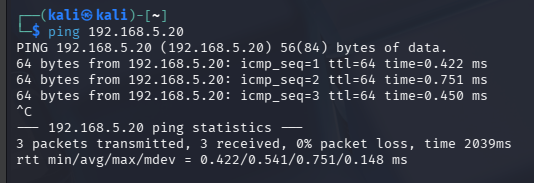
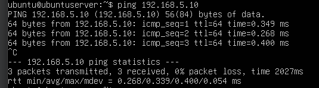

# Configuración del Entorno de Laboratorio

Este documento detalla la infraestructura virtualizada configurada para la simulación de ataque y remediación sobre la aplicación web AutoApply Bot.

## 1. Configuraciones Internas (Ubuntu Server)

### Configuración de IP Estática (Netplan)
Para garantizar la conectividad constante dentro de la red interna, se configuró una IP estática en la máquina víctima editando el archivo de Netplan (`/etc/netplan/00-installer-config.yaml`):

```yaml
network:
  ethernets:
    enp0s3:
      dhcp4: true
    enp0s8:
      dhcp4: false
      addresses:
        - 192.168.5.20/24
  version: 2
```
### Configuración del Servicio SSH
Se instaló OpenSSH Server y se habilitó el acceso modificando el puerto de escucha predeterminado en `/etc/ssh/sshd_config`:

```
Port 2222
```

Tras el cambio, el servicio fue reiniciado y habilitado en el arranque.

---

## 2. Especificaciones de las Máquinas Virtuales (VMs)

El laboratorio consta de dos máquinas interconectadas mediante VirtualBox, configuradas con las siguientes especificaciones:

**VM 1: Máquina Ofensiva (Red Team)**
* **Sistema Operativo:** Kali Linux (Debian 64-bit)
* **Versión:** 2026.1
* **RAM:** 4 GB
* **Almacenamiento:** 80 GB
* **Red:** * Adaptador 1: NAT
           *  Adaptador 2: Red Interna (IP: 192.168.5.10)

**VM 2: Máquina Víctima (Blue Team)**
* **Sistema Operativo:** Ubuntu Server
* **Versión:** 22.04 LTS
* **RAM:** 2 GB
* **Almacenamiento:** 20 GB
* **Red:** * Adaptador 1: NAT
           * Adaptador 2: Red Interna (IP: 192.168.5.20)

---

## 3. Diagrama de Red de la Topología



---

## 4. Evidencia de Conectividad

**Ping desde Kali Linux hacia Ubuntu Server:**



**Ping desde Ubuntu Server hacia Kali Linux:**

