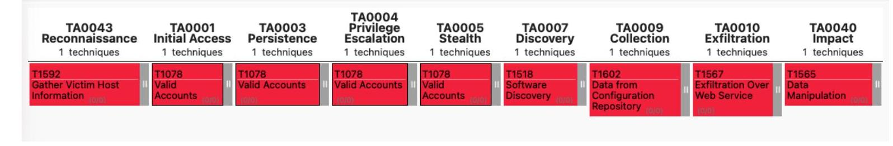

# Mapeo MITRE ATT&CK® — AutoApply Bot

**Proyecto:** Simulación de Ataque Informático y Remediación (Ciberseguridad, UCAB 2025-2026)
**Responsable:** Anthonny Baladi (Líder Ofensivo / coordinación Red Team)
**Framework:** MITRE ATT&CK® Enterprise

> Borrador generado a partir de la explotación documentada en
> `docs/exploitation-report.md`. Anthonny debe revisarlo y ajustarlo como líder
> ofensivo antes de la entrega final.

## Por qué MITRE ATT&CK® y no Cyber Kill Chain

Cyber Kill Chain está diseñado para intrusiones basadas en malware y amenazas
persistentes, con fases como *Instalación* y *Comando y Control* que no aplican a
vectores de aplicación web como los de este proyecto (no se instala software
malicioso ni se establece un canal de C2). MITRE ATT&CK® permite un mapeo granular
por táctica y técnica (TTPs), y cubre nativamente los vectores usados aquí:
explotación de aplicación pública, abuso de cuentas válidas, recolección de datos
y manipulación del sistema.

## Diagrama de mapeo

## Cadena de ataque

| Fase | Táctica | Técnica | Acción concreta ejecutada |
|---|---|---|---|
| 1 | TA0043 Reconnaissance | T1592 Gather Victim Host Information | Nmap contra `192.168.5.20` + forzar JSON malformado para leer el stack trace expuesto por A10:2025 |
| 2 | TA0001 Initial Access | T1078 Valid Accounts | Registro de cuenta legítima (`POST /api/auth/register`) y obtención de JWT válido |
| 3 | TA0007 Discovery | T1518 Software Discovery | Confirmación de que los recursos (`proposals`) usan IDs numéricos secuenciales |
| 4 | TA0009 Collection | T1213 Data from Information Repositories | Lectura de propuestas ajenas vía IDOR (`GET /api/proposals/:id`, `GET /api/proposals`) |
| 5 | TA0010 Exfiltration | T1567 Exfiltration Over Web Service | Modificación y eliminación de recursos ajenos vía la propia API REST (`PATCH`, `DELETE`) |
| 6 (innovación) | TA0040 Impact | T1565 Data Manipulation | Inyección de instrucciones en la descripción de una oferta de trabajo para manipular el contenido generado por IA (Prompt Injection) |

## Técnicas adicionales (vulnerabilidades fuera del alcance obligatorio)

| Vulnerabilidad | Táctica | Técnica |
|---|---|---|
| Information Leak en reset de contraseña (CWE-200) | TA0043 Reconnaissance | T1592 |
| Account Takeover con token robado | TA0001 Initial Access | T1078 |
| RCE vía `eval()` (CWE-94) | TA0007 Discovery / TA0040 Impact | T1082 System Information Discovery |

## Descripción paso a paso

**Fase 1 — Reconocimiento.** El atacante escanea puertos y servicios con Nmap, y
envía solicitudes deliberadamente malformadas (IDs no numéricos, JSON incompleto)
para forzar excepciones no controladas. Gracias a A10:2025, el middleware de
manejo de errores expone en la respuesta HTTP rutas internas del servidor,
nombres de librerías (`body-parser`, `raw-body`) y la estructura del stack
tecnológico — un mapa técnico completo sin haber comprometido nada aún.

**Fase 2 — Acceso inicial.** El atacante registra una cuenta legítima a través del
endpoint público de registro y obtiene un JWT válido mediante el login. A partir de
aquí posee credenciales reales para interactuar con cualquier endpoint protegido,
sin haber roto ningún mecanismo de autenticación.

**Fase 3 — Descubrimiento.** El atacante identifica que los recursos de negocio
(`proposals`) se referencian por IDs numéricos secuenciales expuestos directamente
en la URL, lo cual constituye el vector de explotación IDOR.

**Fase 4-5 — Recolección y Exfiltración.** Aprovechando A01:2025 (ausencia de
validación de propiedad), el atacante lee, modifica y elimina propuestas de otros
usuarios usando únicamente su propio token — sin necesitar privilegios elevados ni
comprometer las credenciales de la víctima.

**Fase 6 — Impacto (innovación).** El atacante publica una oferta de trabajo con
una descripción que contiene instrucciones dirigidas al modelo de IA en lugar de
texto descriptivo. Como el prompt concatena esos datos sin delimitadores, el
modelo puede llegar a obedecer parcialmente instrucciones inyectadas en vez de
generar la propuesta esperada, alterando contenido que eventualmente llega a
terceros reales en la plataforma.

## Referencia

Evidencia completa de cada fase en `docs/exploitation-report.md` y
`docs/Evidencias/`.
